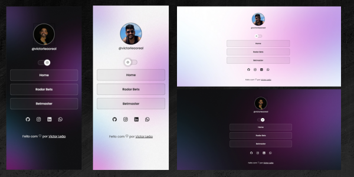

<h1 align="center">InstagramLink - Leia-me</h1>

  

<h2>Visão Geral</h2>

  Bem-vindo ao repositório do InstagramLink! Este projeto tem como objetivo criar um site amigável e personalizável que funcione como um "Linktree para o Instagram", permitindo que os usuários exibam seus diversos perfis e links relevantes em um só lugar. Se você é um influenciador, criador de conteúdo ou apenas deseja compartilhar suas presenças online de forma eficiente, o InstagramLink é perfeito para você.

<h2>Recursos</h2>

<ul>
  <li><strong>Personalização Fácil:</strong> Personalize sua página do InstagramLink com sua própria foto de perfil, plano de fundo e esquema de cores para representar seu estilo único.</li>
  <li><strong>Links Relevantes:</strong> Adicione links para seus perfis nas redes sociais, canal do YouTube, blog e outros links importantes, facilitando para os seguidores encontrarem seus conteúdos online.</li>
  <li><strong>Contato e Mensagens:</strong> Inclua opções para que seus seguidores possam entrar em contato com você e enviar mensagens diretamente pelo InstagramLink.</li>
  <li><strong>Design Responsivo:</strong> O site é otimizado para funcionar perfeitamente em dispositivos desktop e móveis, garantindo uma experiência consistente para seus visitantes.</li>
  <li><strong>Estatísticas de Cliques:</strong> Monitore o desempenho de sua página InstagramLink com suporte integrado para rastrear os cliques em seus links.</li>
</ul>

<h2>Visualização</h2>

  

<h2>Uso</h2>

<ol>
  <li>Faça um fork deste repositório para sua conta do GitHub.</li>
  <li>Clone o repositório forkado para sua máquina local:</li>
</ol>

<pre><code>git clone https://github.com/seu-nome-de-usuario/instagramlink.git</code></pre>

<ol start="3">
  <li>Navegue até o diretório do projeto:</li>
</ol>

<pre><code>cd instagramlink</code></pre>

<ol start="4">
  <li>Personalize o site:</li>
</ol>

<ul>
  <li>Substitua <code>logo.png</code> e <code>preview.png</code> pelas suas próprias imagens.</li>
  <li>Edite <code>index.html</code> para adicionar seus links relevantes, informações de contato e mensagens.</li>
  <li>Modifique o CSS em <code>styles.css</code> para alterar a aparência e as cores de sua página.</li>
</ul>

<ol start="5">
  <li>Faça commit das suas alterações e envie para seu repositório no GitHub:</li>
</ol>

<pre><code>git add .
git commit -m "Personalizei o InstagramLink"
git push origin master</code></pre>

<ol start="6">
  <li>Habilite o GitHub Pages para o repositório:</li>
</ol>

<ul>
  <li>Vá para a aba <strong>Configurações</strong> do seu repositório no GitHub.</li>
  <li>Role para baixo até a seção <strong>GitHub Pages</strong>.</li>
  <li>Escolha o branch <strong>master</strong> como a origem para as GitHub Pages.</li>
  <li>Clique em <strong>Salvar</strong> para gerar o link para sua página InstagramLink ao vivo.</li>
</ul>

<h2>Contribuições</h2>

  Contribuições para este projeto são bem-vindas! Se você tiver melhorias, correções de bugs ou novos recursos para sugerir, sinta-se à vontade para abrir um issue ou enviar um pull request.

<h2>Licença</h2>

  Este projeto está licenciado sob a Licença MIT - consulte o arquivo <a href="LICENSE">LICENSE</a> para obter mais detalhes.

<h2>Reconhecimentos</h2>

  O projeto foi inspirado no serviço original <a href="https://linktr.ee/">Linktree</a>, que revolucionou a forma como as pessoas compartilham vários links em plataformas de mídia social.

<h2>Contato</h2>

  Se tiver alguma dúvida ou feedback sobre este projeto, sinta-se à vontade para entrar em contato com o criador:
   
  Seu Nome - seu.email@example.com

  Vamos tornar o compartilhamento de links para o Instagram mais conveniente e estiloso juntos! Feliz codificação! 😊

